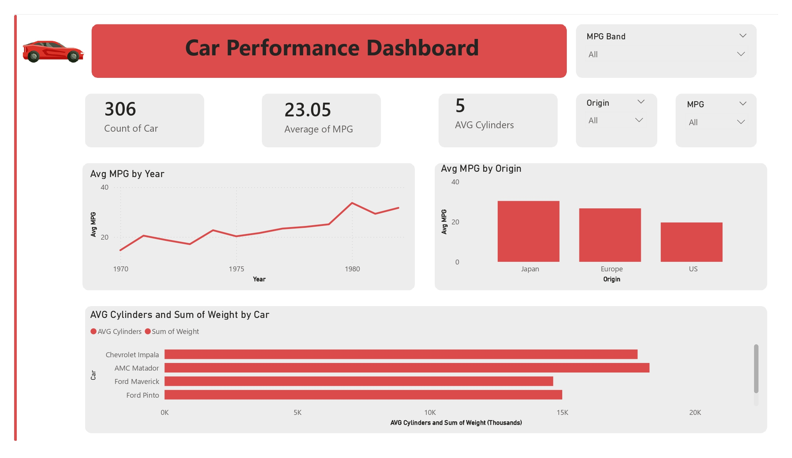

# Car Performance Dashboard 🚗📊

## Project Overview

This project presents an interactive **Car Performance Dashboard** built using **Microsoft Power BI**. The dashboard analyzes historical car data to explore performance indicators such as fuel efficiency, engine cylinders, and vehicle weight across different origins and years.

The goal of the dashboard is to help users quickly understand trends and comparisons in car performance.

## Dashboard Highlights

The dashboard includes several key insights:

* **Total Cars:** 306 vehicles in the dataset
* **Average MPG:** 23.05 miles per gallon
* **Average Cylinders:** 5 cylinders per car on average

These key performance indicators are displayed at the top of the dashboard for quick reference. 

## Visualizations

The dashboard contains multiple interactive visuals:

1. **Average MPG by Year**

   * Line chart showing how fuel efficiency changed from 1970 to the early 1980s.

2. **Average MPG by Origin**

   * Bar chart comparing fuel efficiency of cars from:
   * Japan
   * Europe
   * United States

3. **Average Cylinders and Total Weight by Car**

   * Horizontal bar chart comparing different car models.

4. **Interactive Filters**

   * Origin
   * MPG
   * MPG Band

These filters allow users to dynamically explore the dataset and focus on specific car categories.

## Tools and Technologies

* **Power BI Desktop**
* **Excel Dataset**
* Data visualization and dashboard design

## Dataset

The dataset contains information about various car models including:

* Car Name
* Origin
* MPG (Miles per Gallon)
* Cylinders
* Weight
* Year

## How to Use

1. Open the `.pbix` file using **Power BI Desktop**.
2. Use the filters on the right side of the dashboard.
3. Explore trends across different years, origins, and car models.

## Author

Created by **Abdelrhman Aja** as part of a **Data Visualization / Business Intelligence project**.

## License

This project is for educational purposes.
